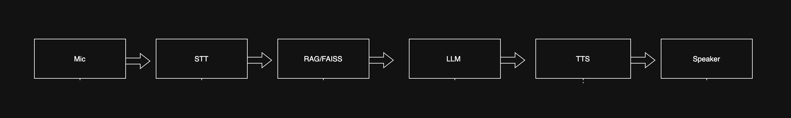

# Voice AI Agent with RAG using VideoSDK

Build a voice agent that listens, retrieves answers from your documents, and responds with synthetic speech, powered by VideoSDK Agents SDK.

---

## Overview

- Voice agent pipeline: Speech-to-text → RAG doc retrieval → LLM answer → Text-to-speech
- Local RAG with FAISS vectorDB and OpenAI embeddings
- Falls back to LLM if no context is found in docs

---

## Demo



---

## Features

- Real-time speech input and output
- Answers from your provided docs using vector search
- General fallback to LLM for all other topics
- Modular code for easy extensions

---

## Setup Instructions

### 1. Clone & Install
```bash
git clone https://github.com/kstij/VideoSDK.git
cd videosdk
python3.12 -m venv venv
source venv/bin/activate
pip install -r requirements.txt
```

### 2. Environment Variables
Create a `.env` file:
```
VIDEOSDK_AUTH_TOKEN=your_videosdk_token
OPENAI_API_KEY=your_openai_key
DEEPGRAM_API_KEY=your_deepgram_key
ELEVENLABS_API_KEY=your_elevenlabs_key
```

### 3. Add Knowledge Base
Put `.txt` files inside the `docs/` folder.
```
docs/doc1.txt
docs/doc2.txt
```

### 4. Run the Agent
```bash
python main.py console
```

---

## Github Repo

[GitHub Repository](https://github.com/kstij/VideoSDK)

---

## Example Queries & Expected Behavior

- Q: Who created Python?
  - Agent answers from doc chunk if present: “Guido van Rossum.”
- Q: What is FAISS?
  - Agent retrieves from docs and answers: “FAISS is an open-source library for vector search.”
- Q: Who is the US president?
  - Agent uses LLM fallback: Responds from the base LLM (if not covered by docs).

---

## How it Works

1. User speech recognized as text
2. Query is embedded; top doc chunks found using FAISS
3. Chunks passed as context to the LLM
4. LLM output synthesized to speech

---

## Requirements

- Python 3.12+
- VideoSDK Agents SDK
- FAISS
- OpenAI, Deepgram, ElevenLabs API keys

---

## Why This?
- Brings voice, RAG, and LLM together in real time
- Shows both doc-aware and fallback capabilities
- Developer-focused for demo, hack, and extension

---

---

## Next Steps
- Integrate browser or client frontend
- Swap out for local vector DBs or models
- Build analytics or agent memory

Reach out to kshitijvarma!  
Bring your voice agent to life.
